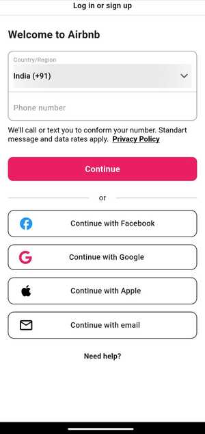
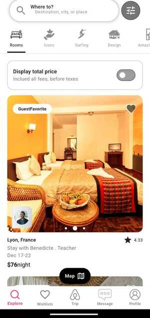
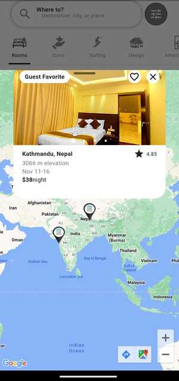
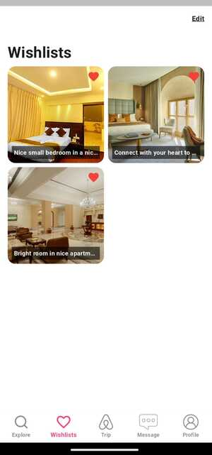
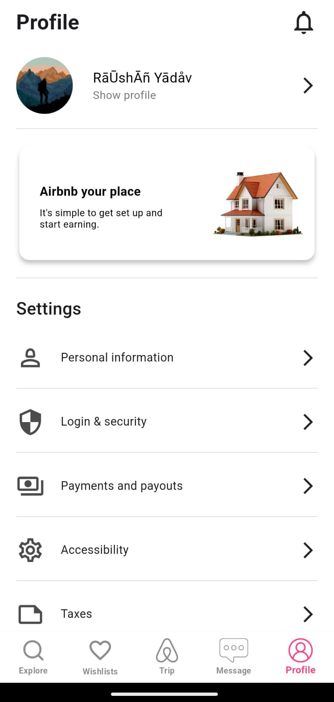

# Airbnb

A fully functional Airbnb clone built using Flutter and Firebase. This app allows users to browse hotel listings, log in with Google, view locations on a map, and save favorite hotels to a wishlist.

## ✨ Features
- 🔑 **Google Authentication** – Users can log in using their Google account.
- 🏨 **Hotel Listings** – Hotels are fetched from a Firebase database.
- 🗺️ **Map Integration** – View hotel locations directly on an interactive map.
- ❤️ **Wishlist Feature** – Users can save and manage their favorite hotels.
- 📡 **Firebase Backend** – Stores hotel data and user information.
- ⚡ **Provider for State Management** – Efficient app-wide state handling.
- 📱 **Responsive UI** – Works smoothly across different screen sizes.

## 📸 Screenshots

###  Login Screen
   

###  Home Screen
   

###  Map
   

###  WishList
   

###  Login Screen
   

## 🛠️ Technologies Used
- **Flutter** – UI development
- **Firebase** – Authentication & database
- **Google Maps API** – Map integration
- **Provider** – State management

## Getting Started

This project is a starting point for a Flutter application.

A few resources to get you started if this is your first Flutter project:

- [Lab: Write your first Flutter app](https://docs.flutter.dev/get-started/codelab)
- [Cookbook: Useful Flutter samples](https://docs.flutter.dev/cookbook)

For help getting started with Flutter development, view the
[online documentation](https://docs.flutter.dev/), which offers tutorials,
samples, guidance on mobile development, and a full API reference.
